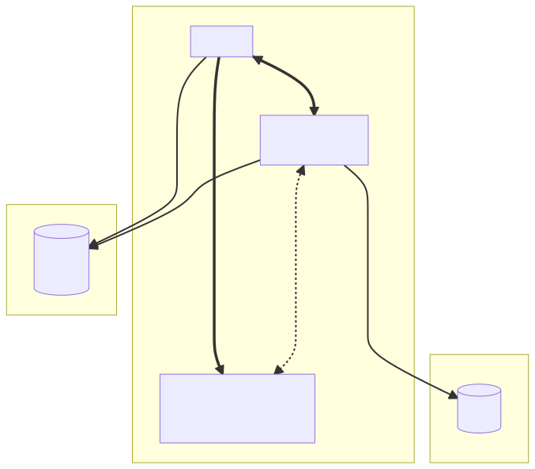

# BuildKit frontend for Gosh

## Architecture



## Build and sign an image from Gosh

### 1. Setup environment variables with your wallet

```bash
export WALLET=...
export WALLET_PUBLIC=...
export WALLET_SECRET=...
```

### 2. Write `dockerfile-for-gosh.yaml` (this specification is far from complete, think of it as a proof of concept)

```yaml
# syntax=teamgosh/goshfile

apiVersion: 1
image: bash:latest
steps:
  - name: print date
    run:
      command: ["/usr/local/bin/bash"]
      args:
        - -c
        - >-
          (date +'%s %H:%M:%S %Z'; echo "Hi there") | tee /message.txt
      # here will be gosh mounts (WIP)
```

### 3. Now build an image

```bash
TARGET_IMAGE="my-target-super-image"

# run buildkitd containered
docker run -d --name buildkitd --privileged moby/buildkit:latest
# build image
buildctl --addr=docker-container://buildkitd build \
        --frontend gateway.v0 \
        --local dockerfile=. \
        --local context=. \
        --opt source=teamgosh/goshfile \
        --opt filename=goshfile.yaml \
        --opt wallet_public="$WALLET_PUBLIC" \
        --output type=image,name="$TARGET_IMAGE",push=true
```

Here we parameterize the image build process with our wallet credentials.

### 4. Sign the image (WIP: will be part of build image process)

```bash
docker pull $TARGET_IMAGE # buildkit push image directly to the registry and it doesn't persist locally

# my-target-super-image's sha256
TARGET_IMAGE_SHA=`docker inspect --format='{{index (split (index .RepoDigests 0) "@") 1}}' $TARGET_IMAGE`

docker run --rm teamgosh/sign-cli sign \
    -n <blockchain_network e.g. https://gra01.net.everos.dev> \
    -g $WALLET \
    -s $WALLET_SECRET \
    $WALLET_SECRET \  # signer secret can be different
    $TARGET_IMAGE_SHA
```

Now we have signed the image!

## We can check the image signature with our public key

```bash
TARGET_IMAGE="my-target-super-image"
# or IMAGE_NAME="my_repo:5000/library/my-target-super-image:latest@sha256:..."

WALLET_PUBLIC=$(docker inspect --format='{{.Config.Labels.WALLET_PUBLIC}}' $TARGET_IMAGE)

TARGET_IMAGE_SHA=$(docker inspect --format='{{index (split (index .RepoDigests 0) "@") 1}}' $TARGET_IMAGE)

docker run --rm content-signature check \
    -n <blockchain_network e.g. https://gra01.net.everos.dev> \
    $WALLET_PUBLIC \
    $TARGET_IMAGE_SHA
```

**NOTE**:
Anyone who has the image can validate it.
The image has label WALLET_PUBLIC and image's sha256 also publically available.

## Examples

[Publisher example](./examples/publisher)

## Build buildkit frontend for Gosh yourself

```bash
go mod vendor
docker build -f Dockerfile -t goshfile .
docker push goshfile
```

or for custom docker registry:

```bash
go mod vendor
docker build -f Dockerfile -t my-reg-url:5000/goshfile .
docker push my-reg-url:5000/goshfile
```
